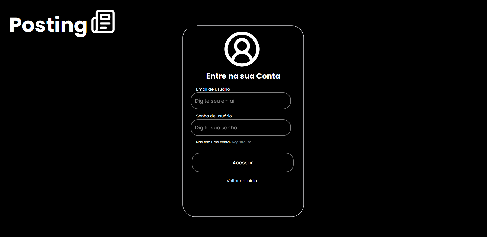
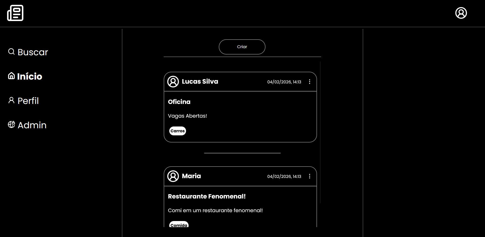
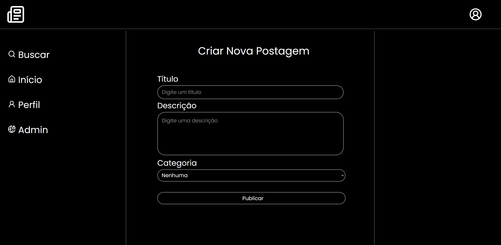

# Posting - API RESTful de Gerenciamento de Postagens

<div align="center">
  
</div>

## Sobre o Projeto

**Posting** é uma API RESTful completa desenvolvida em Java com Spring Boot, projetada para gerenciar postagens, comentários, categorias e usuários. O projeto inclui um frontend moderno e intuitivo desenvolvido em HTML, CSS e JavaScript puro.

A aplicação implementa autenticação e autorização via JWT (JSON Web Tokens), garantindo segurança e controle de acesso para todas as operações.

---

## Funcionalidades

### Autenticação e Autorização
- Login de usuários com JWT
- Proteção de rotas e endpoints
- Controle de acesso baseado em roles

### Gerenciamento de Postagens
- Criação, leitura, atualização e exclusão de postagens
- Categorização de postagens
- Paginação de resultados
- CRUD completo de postagens

### Sistema de Comentários
- Adicionar comentários nas postagens
- Gerenciamento de comentários por usuário
- Relacionamento entre postagens e comentários
- CRUD completo de comentários

### Gerenciamento de Usuários
- Cadastro e autenticação de usuários
- Perfil de usuário com endereço
- Atualização de dados pessoais
- CRUD completo de usuários e endereços

### Categorias
- Organização de postagens por categorias
- CRUD completo de categorias

---

## Interface do Usuário

<div align="center">
  
### Tela de Login


### Hub de Postagens


### Criar Nova Postagem


</div>

---

## Status do Projeto

Este projeto está em desenvolvimento ativo! Novas funcionalidades estão sendo implementadas regularmente.
Grande parte das funcionalidades já estão disponíveis no backend, e estão sendo integradas ao frontend!

Funcionalidades Futuras <br>
As seguintes features estão planejadas e em desenvolvimento: <br>

- Sistema de Pesquisa Avançado: <br>
Página dedicada de pesquisa
Busca por usuários - encontre pessoas na plataforma
Busca por postagens - pesquise conteúdos por título ou descrição
Busca por categorias - filtre postagens por categoria
Sistema de filtros e ordenação de resultados

- Perfis de Usuário Completos: <br>
Página de perfil personalizada para cada usuário
Visualização de postagens próprias organizadas
Lista de amigos/seguidores
Sistema de seguir/deixar de seguir usuários
Estatísticas do perfil (total de posts, seguidores, etc.)

- Sistema de Interações: <br>
Likes em postagens
Contador de curtidas por postagem
Lista de postagens curtidas pelo usuário
Sistema de salvos - salve postagens para ler depois
Coleção pessoal de postagens salvas

- Painel Administrativo: <br>
Dashboard admin para controle completo do sistema
Gerenciamento de usuários (banir, promover, remover)
Moderação de conteúdo (aprovar, remover postagens)
Gerenciamento de categorias
Controle de recursos privados
Estatísticas e relatórios do sistema
Logs de atividades

---

## Tecnologias Utilizadas

### Backend
- **Java** - Linguagem de programação principal
- **Spring Boot** - Framework para desenvolvimento rápido
- **Spring Security** - Autenticação e autorização
- **Spring Data JPA** - ORM para persistência de dados
- **JWT (JSON Web Tokens)** - Autenticação stateless
- **Bean Validation** - Validação de dados
- **PostgreSQL/MySQL** - Banco de dados relacional
- **Maven** - Gerenciamento de dependências

### Frontend
- **HTML5** - Estruturação de páginas
- **CSS3** - Estilização e layout responsivo
- **JavaScript** - Interatividade e consumo da API

---

## Arquitetura e Padrões

### Padrões Implementados
- **DTO (Data Transfer Object)** - Separação entre camadas
- **Mapper** - Conversão entre entidades e DTOs
- **Repository Pattern** - Abstração de acesso a dados
- **Service Layer** - Lógica de negócio
- **RESTful API** - Padrão de comunicação HTTP

### Recursos Avançados
- Validação de dados com Bean Validation
- Paginação de resultados
- Tratamento de exceções personalizadas
- Relacionamentos entre entidades (One-to-Many, Many-to-One)
- CORS configurado para o frontend

---

## Segurança

### Autenticação JWT
O sistema utiliza JWT para autenticação stateless. Após o login bem-sucedido, o cliente recebe um token que deve ser enviado no header de todas as requisições protegidas:

```http
Authorization: Bearer seu_token_jwt_aqui
```

### Criptografia
- Senhas são criptografadas usando BCrypt
- Tokens JWT são assinados digitalmente

---

<div align="center">
  
### ⭐ Se este projeto foi útil, considere dar uma estrela!

</div>
